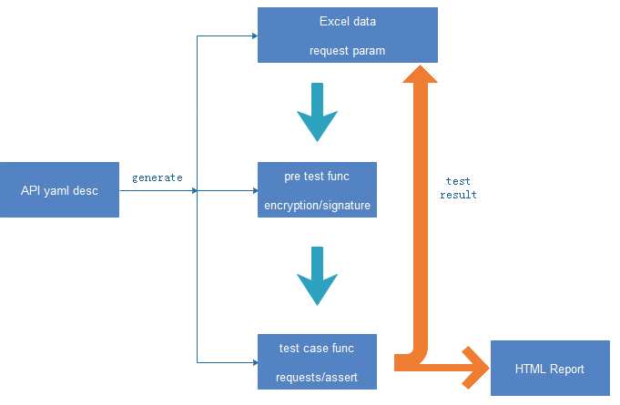

### 设计思想

​	pytester设计为多项目的接口自动化框架，所以框架内部以项目维度划分为一个完整单元。在项目内部，通过yaml描述接口信息，包含接口名、URL、入参、断言等。后续将根据yaml描述自动生成案例excel、pre_test func、test_case。

​	测试数据存放在excel中，案例运行时，数据从excel取出，先经过项目级pre_test func，允许对项目下所有接口数据做相同的处理，例如加密加签等；然后传递给接口各自的pre_test func，允许对每个接口数据做不同的定制化处理；最终将数据以数据驱动的方式传递给测试案例。测试案例运行请求断言后，将每条案例的测试结果回写到数据excel，并生成HTML测试报告。

### 使用教程

​	使用时需要先创建项目以及项目下的目录，然后创建所有测试案例，这些动作现在全部自动化完成。

​	在util目录下，有1、2数字开头的两个模块：

- ***1_create_project.py***用来创建整个项目，只需要给定项目名，先检查项目是否存在，如果存在则放弃创建，不存在则创建
- ***2_create_excel_case.py***用来根据项目conf目录下的案例描述yaml文件，在data下生成对应sheet，在pre_test下生成对应func，在test_cases下生成对应case func；conf目录下会有示例的yaml以作参考

​    案例生成后，可能只需要在requests请求中稍微微调下入参方式，响应断言取值路径即可。

​	运行测试案例，只需要直接运行pytesyer下的***main.py***即可。

### 待完善

​	目前项目核心均已开发完成，但是还剩下一些需要完善：

1. 增加日志模块
2. 完善HTML报告生成方式
3. 运行案例的可配置化选取
4. 案例数据来源的多样性

我会在后面慢慢完善这些功能。